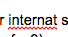

# Mouths are made of:

## * tooths/teeth
## * gums
## * tongues
## * plaque

[Here are some mouths to look at with eyes!](https://www.google.com/search?q=mouths&source=lnms&tbm=isch&sa=X&ved=0ahUKEwiMmKi4q_TPAhXr5IMKHTMBBK0Q_AUICCgB&biw=1313&bih=732)
